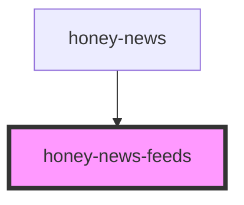

# honey-news-feeds

<!-- Auto Generated Below -->

## Properties

| Property     | Attribute | Description                     | Type         | Default     |
| ------------ | --------- | ------------------------------- | ------------ | ----------- |
| `feedLoader` | --        | Hilfsklasse zum Laden der Daten | `NewsLoader` | `undefined` |

## Dependencies

### Used by

 - [honey-news](..)

### Graph

----------------------------------------------

*Built with [StencilJS](https://stenciljs.com/)* by Huluvu424242
